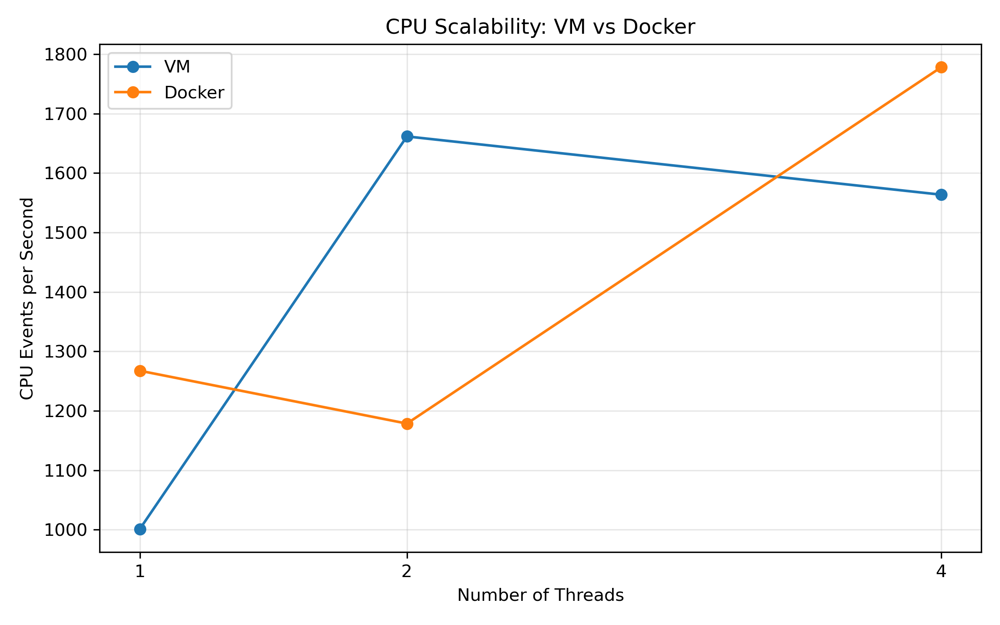
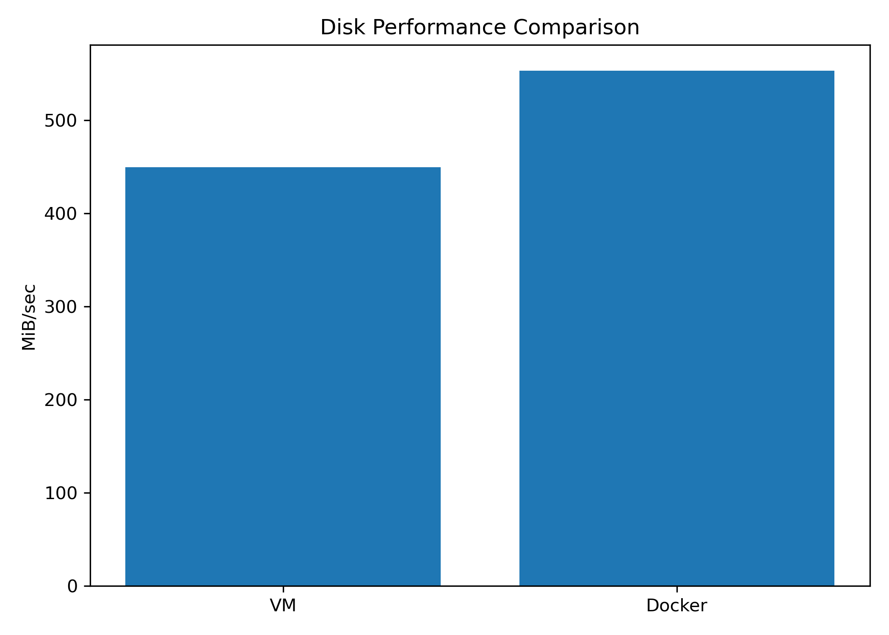
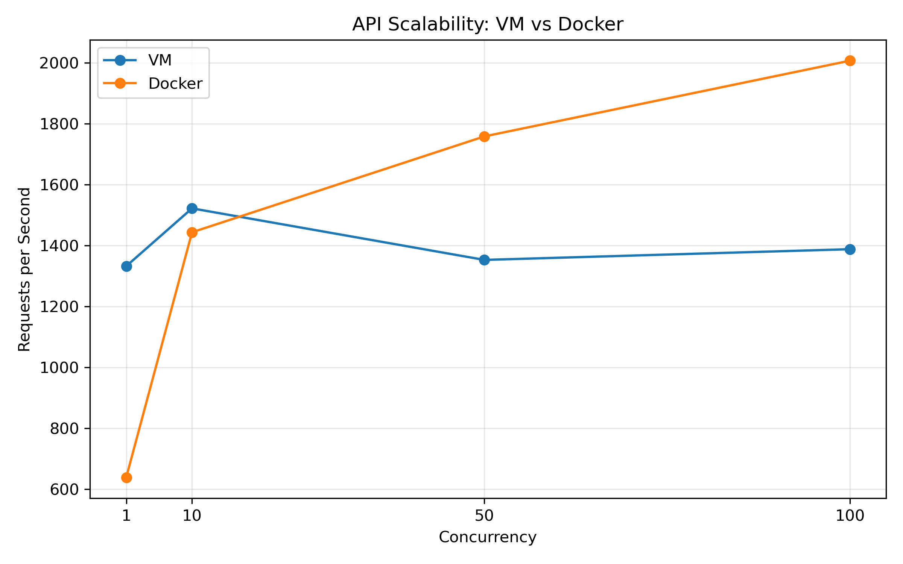

# Performance Analysis of Virtual Machines and Containers

---

# 1. Objectives

The main objectives of this experiment are:

* To study the performance of a **Virtual Machine (VM)** and a **Docker container**.
* To configure and execute benchmarks in both environments.
* To compare CPU, memory, disk, network, and application-level performance.
* To evaluate CPU and API scalability.
* To analyze the performance differences between virtualization and containerization.

---

# 2. Experimental Environment

The experiment was conducted using a Virtual Machine running Ubuntu and Docker containers within the available computing environment.

| Component | Configuration |
|---|---|
| **Host OS** | Windows |
| **Hypervisor** | VMware Workstation |
| **Guest OS** | Ubuntu 26.04.1 LTS |
| **VM CPU** | 2 vCPUs |
| **VM Memory** | 3.27 GiB |
| **VM Disk** | 20 GB |
| **Container Platform** | Docker 29.1.3 |
| **CPU Benchmark** | Sysbench |
| **Memory Benchmark** | Sysbench |
| **Disk Benchmark** | fio |
| **Network Benchmark** | iperf3 |
| **API Benchmark** | ApacheBench (ab) |
| **API Framework** | FastAPI + Uvicorn |

---

# 3. Methodology

The same VM environment was used for both VM-side and container-side testing wherever applicable.

Multiple runs were performed for the CPU, memory, and disk benchmarks, and the average performance was calculated from the valid runs.

The API benchmark was performed using **10,000 requests with concurrency 100** for the `/health` endpoint and **1,000 requests with concurrency 10** for the `/compute` endpoint.

The following performance parameters were evaluated:

* CPU performance
* CPU scalability
* Memory performance
* Disk performance
* Network performance
* API performance
* API scalability

---

# 4. Virtual Machine

## 4.1 Configuration

The Virtual Machine was created using **VMware Workstation** with the following resources:

| Parameter | Configuration |
|---|---|
| **Hypervisor** | VMware Workstation |
| **Guest OS** | Ubuntu 26.04.1 LTS |
| **CPU** | 2 vCPUs |
| **Memory** | 3.27 GiB |
| **Storage** | 20 GB |

The VM was used as the virtualized environment for conducting the performance benchmarks.

---

# 5. Docker Container

## 5.1 Configuration

The container environment was created using **Docker 29.1.3**.

Docker containers share the host kernel and provide application-level isolation without requiring a complete guest operating system for each container.

The same computational environment was used wherever applicable to make the comparison between the VM and Docker container more consistent.

---

# 6. Performance Results

The overall benchmark results obtained from the VM and Docker container are summarized below.

| Benchmark | Metric | VM | Docker |
|---|---|---:|---:|
| **CPU** | Events/sec | 1668.10 | **1751.35** |
| **Memory** | MiB/sec | **23629.16** | 11496.33 |
| **Disk** | MiB/sec | 449.60 | **553.20** |
| **Network** | Gbits/sec | **44.0** | 40.5 |
| **API** | Requests/sec | **3130.57** | 1818.79 |

---

# 7. CPU Performance

The CPU benchmark was performed using **Sysbench** with 2 threads and a 30-second test duration.

## Result

| Environment | CPU Throughput |
|---|---:|
| **Virtual Machine** | 1668.10 events/sec |
| **Docker Container** | **1751.35 events/sec** |

## Observation

The Docker container achieved a slightly higher CPU throughput of **1751.35 events/sec** compared with **1668.10 events/sec** for the VM in this experiment.

## Performance Graph


---

# 8. CPU Scalability

CPU scalability was evaluated by increasing the number of CPU threads from **1 to 4**.

| Threads | VM (events/sec) | Docker (events/sec) |
|---:|---:|---:|
| 1 | 1001.01 | **1267.42** |
| 2 | **1661.66** | 1178.51 |
| 4 | 1563.64 | **1778.05** |

## Observation

The results show that CPU throughput does not increase linearly with thread count. Since the VM has **2 vCPUs**, the 4-thread test introduces thread oversubscription.

## Performance Graph




---

# 9. Memory Performance

The memory benchmark was performed using **Sysbench** with a **1 MiB block size**, **2 GiB total operation size**, and **2 threads**.

## Result

| Environment | Memory Throughput |
|---|---:|
| **Virtual Machine** | **23629.16 MiB/sec** |
| **Docker Container** | 11496.33 MiB/sec |

## Observation

The VM produced higher memory throughput than the Docker container in this experiment.

## Performance Graph


---

# 10. Disk Performance

The sequential write benchmark was performed using **fio** with a **1 GiB test file**, **1 MiB block size**, direct I/O, and a 30-second test.

## Result

| Environment | Disk Throughput |
|---|---:|
| **Virtual Machine** | 449.60 MiB/sec |
| **Docker Container** | **553.20 MiB/sec** |

## Observation

The Docker container achieved higher disk throughput than the VM in this experiment.

One VM disk run produced an unusually low result and lasted significantly longer than the other runs. It was treated as an anomalous run and excluded from the representative average. The original raw result was retained in:

```text
results/raw/disk/vm/
```

## Performance Graph




---

# 11. Network Performance

The network benchmark was performed using **iperf3** for 30 seconds.

## Result

| Environment | Network Throughput |
|---|---:|
| **Virtual Machine** | **44.0 Gbits/sec** |
| **Docker Container** | 40.5 Gbits/sec |

## Observation

The VM achieved higher measured network throughput than the Docker container in this experiment.

The Docker test used the **Docker bridge network**, which resulted in a different networking path from the VM-side test.

This is a local VM-interface benchmark and does not represent Internet bandwidth.

## Performance Graph


---

# 12. API Performance

The application-level benchmark was performed using **ApacheBench (ab)** with a **FastAPI + Uvicorn** application.

The `/health` endpoint was tested using:

* **10,000 requests**
* **Concurrency: 100**

The `/compute` endpoint was tested using:

* **1,000 requests**
* **Concurrency: 10**

## Result

| Environment | Requests/sec |
|---|---:|
| **Virtual Machine** | **3130.57** |
| **Docker Container** | 1818.79 |

## Observation

The VM achieved higher API throughput than the Docker container in the combined API benchmark results used for this experiment.

## Performance Graph


Raw API results are stored in:

```text
results/raw/api/
```

---

# 13. API Scalability

API scalability was evaluated using ApacheBench with the `/health` endpoint and **1,000 total requests** at different concurrency levels.

| Concurrency | VM (requests/sec) | Docker (requests/sec) |
|---:|---:|---:|
| 1 | **1332.04** | 638.18 |
| 10 | **1521.87** | 1443.35 |
| 50 | 1352.61 | **1758.26** |
| 100 | 1387.78 | **2006.91** |

## Observation

The results show that API throughput changes with increasing concurrency. In this experiment, the Docker container achieved higher throughput at the higher concurrency levels.

## Performance Graph




Raw scalability results are stored in:

```text
results/raw/api_scalability/
```

---

# 14. Overall Performance Comparison

The results demonstrate that VM and container performance varies depending on the workload.

| Benchmark | Better Performing Environment |
|---|---|
| **CPU** | Docker |
| **Memory** | VM |
| **Disk** | Docker |
| **Network** | VM |
| **API** | VM |
| **API Scalability at High Concurrency** | Docker |

The results show that neither virtualization approach consistently outperformed the other across all workloads.

---

# 15. Conclusion

This experiment compared the performance of a **Virtual Machine** and a **Docker container** using CPU, memory, disk, network, and application-level benchmarks.

The results showed different performance characteristics for different workloads.

The Docker container achieved better performance in **CPU throughput and disk throughput**, while the VM achieved better performance in **memory, network, and the measured combined API benchmark**.

The scalability experiments also showed that increasing CPU threads or API concurrency does not necessarily produce a linear increase in performance.

Therefore, the experiment demonstrates that **VM and container performance depends strongly on the workload, resource allocation, networking configuration, and virtualization/containerization architecture**.

The results should be interpreted as measurements for this specific experimental environment rather than universal performance values.

---

# 16. Project Structure

```text
vm-vs-container-performance/
│
├── api/
│   ├── Dockerfile
│   ├── main.py
│   └── requirements.txt
│
├── docker/
│   └── Dockerfile
│
├── results/
│   ├── api_comparison.png
│   ├── api_scalability.png
│   ├── cpu_comparison.png
│   ├── cpu_scalability.png
│   ├── disk_comparison.png
│   ├── memory_comparison.png
│   ├── network_comparison.png
│   │
│   ├── processed/
│   │   └── api_scalability.csv
│   │
│   └── raw/
│       ├── api/
│       ├── api_scalability/
│       ├── cpu/
│       ├── cpu_scalability/
│       ├── disk/
│       ├── memory/
│       └── network/
│
├── .gitignore
└── README.md
```

---

# 17. Author and USN

**Author:** Anushree Angadi

**USN:** 01FE24BCI050
